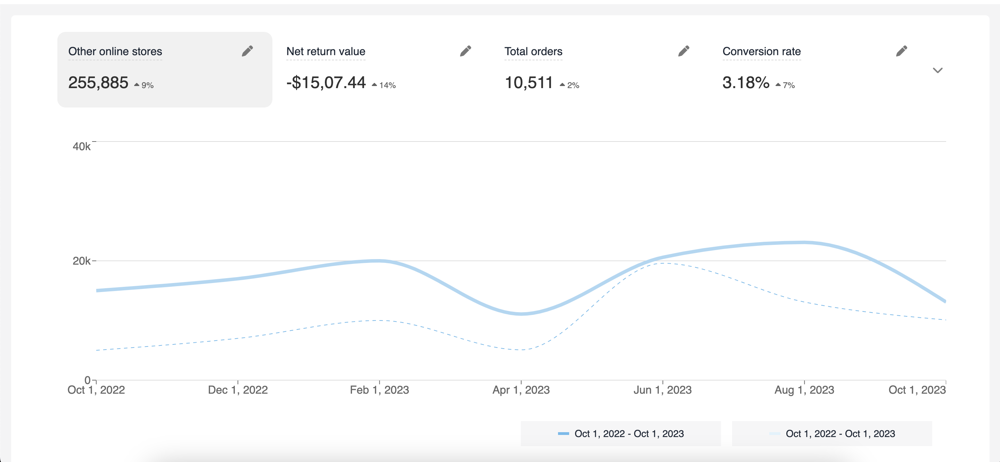
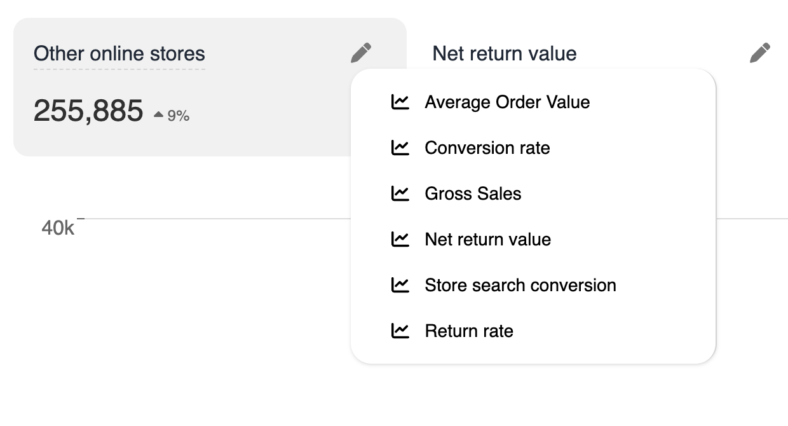
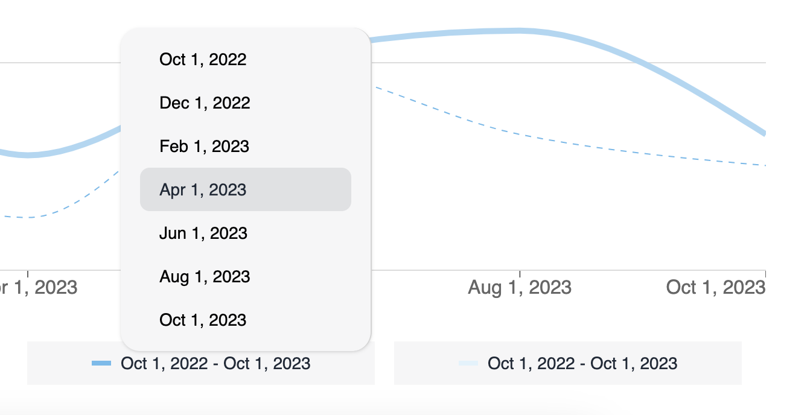
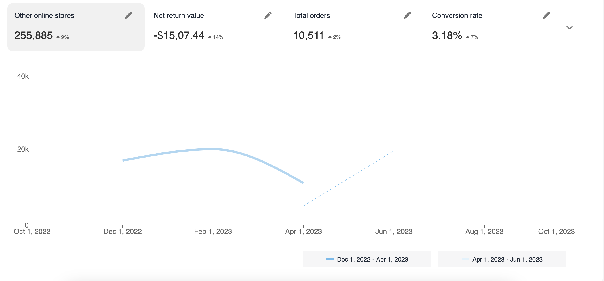

# Getting Started 

## Approach
- Dummy JSON data is used for the dashboard, stored inside `components/dashboard/DashboardData.tsx`.

## Features
- Option for selecting the date

# Usage
- Navigate to the project directory: `cd blog-refine-daisyui && npm i`
- Run the development server: `npm run dev`
- Open your web browser and go to [http://localhost:5173/](http://localhost:5173/).

